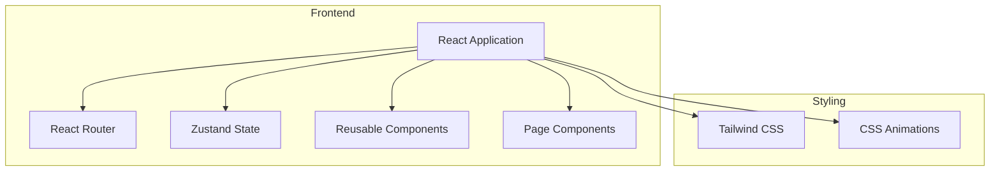
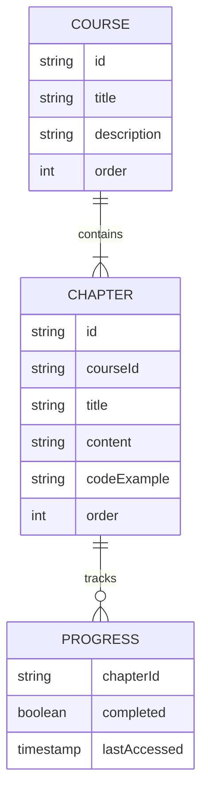

## 1. Architecture Design
本项目采用纯前端架构，使用React框架构建，无需后端服务。

## 2. Technology Description
- Frontend: React@18 + TypeScript + tailwindcss@3 + vite
- Initialization Tool: vite-init
- Backend: None (纯前端项目)
- Database: None (使用本地存储记录学习进度)

## 3. Route Definitions
| Route | Purpose |
|-------|---------|
| / | 首页，课程介绍和章节列表 |
| /chapter/:id | 课程章节详情页 |

## 4. API Definitions (if backend exists)
本项目为纯前端项目，无需后端API。

## 5. Server Architecture Diagram (if backend exists)
本项目无后端服务。

## 6. Data Model (if applicable)
### 6.1 Data Model Definition

### 6.2 Data Definition Language
本项目使用静态数据定义，无需数据库。
