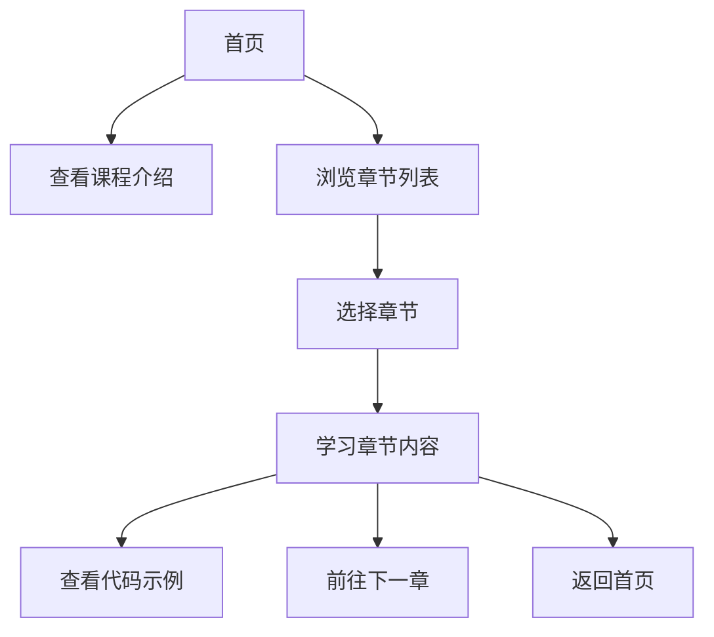

## 1. Product Overview
一个Python基础课程学习平台，为初学者提供结构化的Python编程学习资源。
- 主要目的：帮助零基础学习者系统地学习Python编程基础知识
- 目标用户：编程初学者、学生、希望入门Python的职场人士

## 2. Core Features

### 2.1 User Roles (if applicable)
| Role | Registration Method | Core Permissions |
|------|---------------------|------------------|
| Normal User |无需注册 | 浏览课程内容、学习课程章节 |

### 2.2 Feature Module
1. **首页**: 课程介绍、学习路径导航、课程章节列表
2. **课程章节页**: 课程内容展示、代码示例、学习进度追踪
3. **实践练习页**: 交互式代码编辑器、练习题目

### 2.3 Page Details
| Page Name | Module Name | Feature description |
|-----------|-------------|---------------------|
| 首页 | Hero区域 | 展示Python课程标题、简短介绍、开始学习按钮 |
| 首页 | 课程概述 | 介绍课程大纲、学习目标、适合人群 |
| 首页 | 章节导航 | 显示所有课程章节，点击进入对应章节 |
| 课程章节页 | 章节内容 | 展示该章节的详细知识点、概念说明 |
| 课程章节页 | 代码示例 | 展示可运行的Python代码示例 |
| 课程章节页 | 导航控制 | 上一章/下一章导航按钮 |

## 3. Core Process
用户访问首页，查看课程介绍和章节列表，选择感兴趣的章节开始学习。在章节页面学习内容和代码示例，然后可以继续学习下一章或返回首页选择其他章节。

## 4. User Interface Design
### 4.1 Design Style
- 主色调：深蓝色(#1E3A8A)，代表专业和学习
- 辅助色：黄色(#F59E0B)，用于强调和引导
- 按钮风格：圆角矩形，带有微妙的阴影和悬停效果
- 字体：使用 JetBrains Mono 作为代码字体，Poppins 作为正文和标题字体
- 布局风格：卡片式布局，清晰的信息层次
- 图标风格：简洁的线性图标，使用 Lucide React

### 4.2 Page Design Overview
| Page Name | Module Name | UI Elements |
|-----------|-------------|-------------|
| 首页 | Hero区域 | 渐变背景，大标题，简短描述，醒目的开始学习按钮 |
| 首页 | 课程概述 | 三列卡片布局，展示课程特点 |
| 首页 | 章节导航 | 网格布局的章节卡片，带有进度指示器 |
| 课程章节页 | 章节内容 | 左侧目录导航，右侧内容区域，代码块高亮 |
| 课程章节页 | 导航控制 | 底部固定的导航栏，上一章/下一章按钮 |

### 4.3 Responsiveness
桌面优先设计，移动端自适应。在小屏幕设备上优化布局，确保内容可读性和交互便捷性。

### 4.4 3D Scene Guidance (if applicable)
本项目不涉及3D场景
